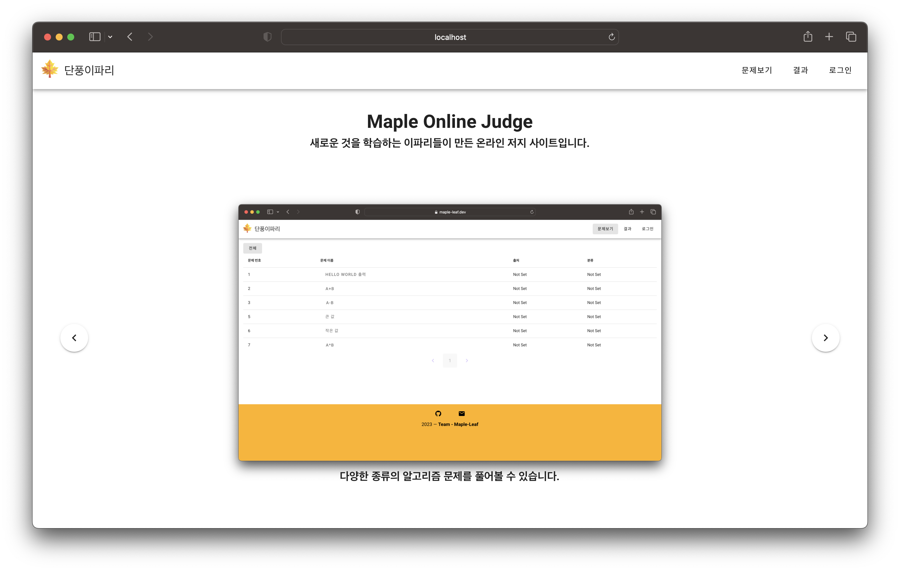

# 단풍이파리

<div align="center">
  <p>
     
  </p>
  
  <p>
    온라인 저지 플랫폼
  </p>

  <p>

[](https://github.com/Team-Maple-Leaf/MapleJudgePlatform/actions/workflows/docker-build.yml) [](https://github.com/Team-Maple-Leaf/MapleJudgePlatform/actions/workflows/build.yml) [](https://github.com/Team-Maple-Leaf/MapleJudgePlatform/blob/main/License) [](https://github.com/Team-Maple-Leaf/MapleJudgePlatform/issues)

  </p>
  
  
  
</div>

프로그래밍 문제를 풀고 코드를 제출하여 온라인에서 채점 받을 수 있습니다.

##

## Project Setup

```sh
pnpm i
```

### Compile and Hot-Reload for Development

```sh
pnpm dev
```

### Type-Check, Compile and Minify for Production

```sh
pnpm build
```
